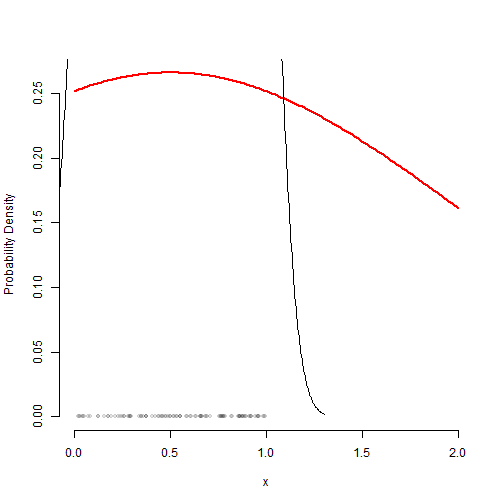

# An Example Shiny App


## The basic plot for display.

The inputs to the whole picture are given as arguments to the function.


```r
drawDistribution <- function(fun=dbeta,param1=1,param2=.5,xlim=c(0,1),xdata=NULL){
  x <- seq(xlim[1],xlim[2],length=200)
  y <- fun(x, param1,param2)
  # Get rid of points not in the domain of the distribution
  keep <- is.finite(y)
  y <- y[keep]
  x <- x[keep]
  plot(x,y,type='l',xlim=xlim,lwd=2,col="red",ylim=c(0,max(y)),
       ylab="Probability Density", xlab="x", bty="n")
  if (!is.null(xdata)) {
    points( xdata, rep(0,length(xdata) ), 
            pch=20, col=rgb(0,0,0,.1) )
    dens <- density(xdata)
    lines( dens$x, dens$y )
    }
  }
```


```r
drawDistribution(dnorm,.5,1.5,xdata=runif(100),xlim=c(0,2))
```

 

## A User Interface

This will be given as an argument to `bootstrapPage()`.  This is not a function. These contents are entirely static.  They are run once and define the slots and widgets for the user interface.

You will also name the addressable elements here.  Make sure to name them in a way that doesn't conflict with other components of the UI that other people are developing.

Assume the stem of the name, unique to your part of the project, is `dist`, short for distribution.


```r
myUI <- div(
  div(class='jumbotron masthead',
      h3('The ß Distribution'),
      p('Showing the shape of the ß distribution.' ),
      actionButton(inputId="submitted","Send in your parameters.")
  ),
  div(class='row span9 well',
    div(class='span3 well',
        selectInput("distDistrib","Choice of Distribution", 
                    list(uniform="uniform",gaussian="normal",
                         beta="beta", "chi squared" ="chisq"), 
                    selected="beta"),
        sliderInput("distParam1", "Parameter 1", min=0.01,max=2,step=0.01, value=0.5),
        sliderInput("distParam2", "Parameter 2", min=0.01,max=2,step=0.01, value=0.1)
        ),
    div(class='span4 well',
        plotOutput("distPlot1"),
        sliderInput("distXrange", "X-axis Range", 
                    min=-10, max=10, step=0.5, value=c(0,1))
    )
  )
)
```

A utility function to give the parameter names and other features for each distribution.


```r
paramNames <- function(name){
  res <- switch(EXPR=name,
         uniform=list(distParam1='min',distParam2="max",
                      domain=c(-Inf,Inf),
                      fun=function(x,param1,param2){
                        if( param1 >= param2 ) stop("Max must be larger than min")
                        dunif(x,min=param1,max=param2)}),
         normal=list(distParam1='mean',distParam2="sd",
                     domain=c(-Inf,Inf),
                     fun=function(x,param1,param2){
                       dnorm(x,mean=param1,sd=param2)}),
         beta=list(distParam1='a',distParam2="b",
                   domain=c(0.001,.999),
                   fun=function(x,param1,param2){
                     dbeta(x,shape1=param1,shape2=param2)}),
         chisq=list(distParam1='df', distParam2='-- not used --',
                    domain=c(0,Inf),
                    fun=function(x, param1,param2){
                      dchisq(x,df=param1)})
         )
  return(res)
}
```

## Outside Data

Since we will be building a team app, it can help to use outside data.  For development purposes, just create a global variable.


```r
outsideData <- rbeta(40, shape1=0.2, shape2=1.5)
```


## Defining the server

This server is going to do two things:

1. Draw the plot according to the selected distribution.
2. Change the slider labels to reflect the selected distribution.


```r
myServer <- function(input,output,session){
  # Information that's expensive to calculate or that
  # more than one function needs can be 
  # stored in a reactive expression.
  distInfo <- reactive( paramNames(input$distDistrib) )
  
  # Send something new to the plot
  output$distPlot1 <- renderPlot({
    info <- distInfo()
    drawDistribution(fun=info$fun,
                     param1=input$distParam1, param2=input$distParam2, 
                     xdata=outsideData, xlim=input$distXrange )
    })
  # Change the slider names
  observe( {
    input$distDistrib # creates the dependancy
    nms <- distInfo()
    updateSliderInput(session, inputId='distParam1',
                      label=nms[['distParam1']])
    updateSliderInput(session, inputId='distParam2',
                      label=nms[['distParam2']] )                    
    
    })
}
```


## Displaying the App

To run the app, you will have to run all the chunks above, then run this chunk each time you want to start the app anew.


```r
runApp(list(ui = bootstrapPage(myUI), 
            server = myServer))
```


