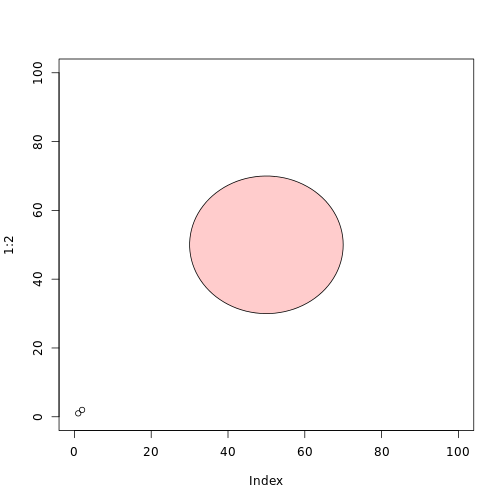

Writing Functions Exercise 
========================================================

## Graphics 
1. canvas <- function(mn=0,mx=100) {
plot( 1:2, xlim=c(mn,mx), ylim=c(mn,mx))}

2. 

```r
canvas <- function(mn = 0, mx = 100) {
    plot(1:2, xlim = c(mn, mx), ylim = c(mn, mx))
}

circle <- function(x, y, r, ...) {
    angs <- seq(0, 2 * pi, length = 100)
    xpts <- x + r * cos(angs)
    ypts <- y + r * sin(angs)
    polygon(xpts, ypts, ...)
}
```


Here's my graph:

```r
canvas()
circle(50, 50, 20, col = rgb(1, 0, 0, 0.2))
```

 

