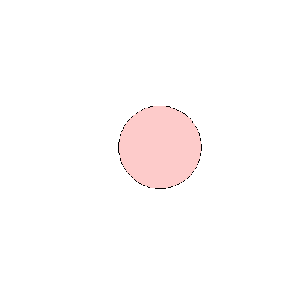
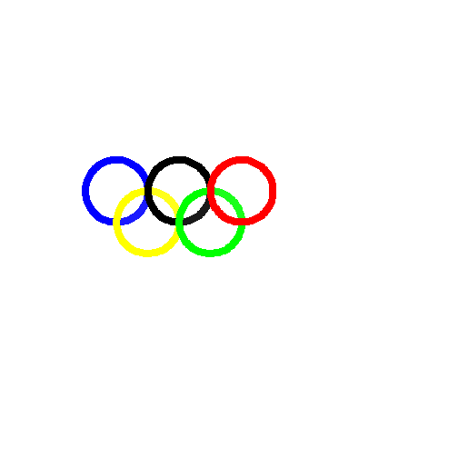

Writing Functions Exercise 
========================================================
## Sums of Numbers

1. Counting Odds

```r
countOdds <- function(x) {
    +x%%2
    +sum(x%%2)
}
```

2. Counting Evens

```r
countEvens <- function(x) {
    +(x + 1)%%2
    +sum(c((x + 1)%%2))
}
```


## Triangles

1. Finding the Hypotenuse

```r
hypotenuselength <- function(a, b) {
    +(a^2)
    +(b^2)
    +sum(a^2, b^2)
    +sqrt(sum(a^2, b^2))
}
```


2. Law of Cosines 


```r
lawofcosines <- function(a, b, theta) {
    +return(sqrt(a^2 + b^2 - 2 * a * b * cos(theta)))
}
```


3. Length from Theta


```r
thetaFromLengths <- function(a, b, c) {
    acos((c^2 - a^2 - b^2)/(-2 * a * b))
}
```

Test Statement:

```r
thetaFromLengths(1, 2, 3)
```

```
## [1] 3.142
```


4. Theta from Lengths Test

```r
thetaFromLengthsTest <- function(a, b, theta) {
    thetaFromLengths(a, b, lawofcosines(a, b, theta)) - theta
}
```

Test Statement: 

```r
thetaFromLengthsTest(13, 84, 0)
```

```
## [1] 0
```


## Graphics 


1. 

```r
canvas <- function(mn = 0, mx = 100) {
    plot(1:2, ylim = c(mn, mx), xlim = c(mn, mx), asp = 1, xaxt = "n", yaxt = "n", 
        type = "n", bty = "n", xlab = "", ylab = "")
}

circle <- function(x, y, r, ...) {
    angs <- seq(0, 2 * pi, length = 100)
    xpts <- x + r * cos(angs)
    ypts <- y + r * sin(angs)
    polygon(xpts, ypts, ...)
}
```


Here's my graph:

```r
canvas()
circle(50, 50, 20, col = rgb(1, 0, 0, 0.2))
```

 


Olympic Rings:


```r
canvas()
circle(10, 60, 10, col = "blue", border = NULL)
circle(10, 60, 8, col = "white", border = NULL)
circle(20, 50, 10, col = "yellow", border = NULL)
circle(20, 50, 8, col = "white", border = NULL)
circle(30, 60, 10, col = "black", border = NULL)
circle(30, 60, 8, col = "white", border = NULL)
circle(40, 50, 10, col = "green", border = NULL)
circle(40, 50, 8, col = "white", border = NULL)
circle(50, 60, 10, col = "red", border = NULL)
circle(50, 60, 8, col = "white", border = NULL)
```

 


