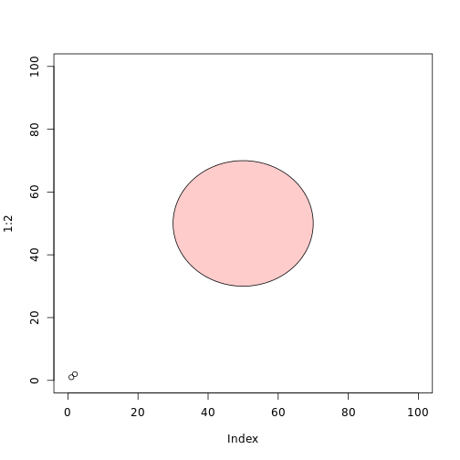

Writing Functions Exercise 
========================================================
## Sums of Numbers

1. Counting Odds

```r
countOdds <- function(x) {
    +x%%2
    +sum(x%%2)
}
```

2. Counting Evens

```r
countEvens <- function(x) {
    +(x + 1)%%2
    +sum(c((x + 1)%%2))
}
```


## Triangles

1. Finding the Hypotenuse

```r
hypotenuselength <- function(a, b) {
    +(a^2)
    +(b^2)
    +sum(a^2, b^2)
    +sqrt(sum(a^2, b^2))
}
```


2. Law of Cosines 


```r
lawofcosines <- function(a, b, theta) {
    +return(sqrt(a^2 + b^2 - 2 * a * b * cos(theta)))
}
```

## Graphics 


1. 

```r
canvas <- function(mn = 0, mx = 100) {
    plot(1:2, xlim = c(mn, mx), ylim = c(mn, mx))
}

circle <- function(x, y, r, ...) {
    angs <- seq(0, 2 * pi, length = 100)
    xpts <- x + r * cos(angs)
    ypts <- y + r * sin(angs)
    polygon(xpts, ypts, ...)
}
```


Here's my graph:

```r
canvas()
circle(50, 50, 20, col = rgb(1, 0, 0, 0.2))
```

 

