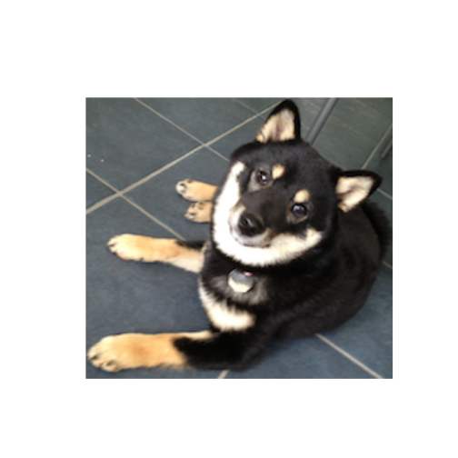

## Starting With Images 


```r
require(png)
```

```
## Loading required package: png
```

```r
require(RCurl)
```

```
## Loading required package: RCurl Loading required package: bitops
```

```r
puppy <- readPNG(getURLContent("http://dtkaplan.github.io/ScientificComputing/Resources/Images/mindo.png"))
COMP121::canvas(x = c(1, 220), y = c(1, 220), asp = 1)
graphics::rasterImage(puppy, 1, 1, 216, 198)
```

 

```r
dim(puppy)
```

```
## [1] 198 216   4
```


## Indexing, Cropping, and Expanding Images 

### Cropping Tasks

#### Mindo's Face

```r
require(png)
require(RCurl)
COMP121::canvas(x = c(1, 220), y = c(1, 220), asp = 1)
```

 

```r
puppy[100:110, 50:70, ]
```

```
## , , 1
## 
##         [,1]   [,2]   [,3]   [,4]   [,5]   [,6]   [,7]   [,8]   [,9]
##  [1,] 0.8078 0.8000 0.7725 0.7647 0.7882 0.7882 0.7725 0.7137 0.6510
##  [2,] 1.0000 1.0000 1.0000 1.0000 1.0000 1.0000 1.0000 1.0000 0.9765
##  [3,] 0.9961 0.9961 0.9961 0.9961 0.9961 0.9961 0.9961 1.0000 1.0000
##  [4,] 0.9961 0.9961 1.0000 1.0000 1.0000 0.9961 1.0000 0.9961 0.9961
##  [5,] 1.0000 0.9961 0.9961 0.9961 0.9961 0.9961 1.0000 1.0000 0.9961
##  [6,] 1.0000 0.9961 0.9922 0.9922 0.9922 0.9961 0.9961 0.9961 1.0000
##  [7,] 0.9961 0.9922 0.9961 0.9961 0.9961 0.9961 0.9922 0.9961 1.0000
##  [8,] 0.9882 0.9922 0.9961 0.9961 0.9961 0.9922 0.9922 0.9922 0.9922
##  [9,] 0.9922 0.9961 0.9961 0.9961 0.9882 0.9804 0.9882 0.9922 0.9961
## [10,] 0.9961 0.9961 0.9961 0.9882 0.9843 0.9922 0.9961 0.9922 0.9961
## [11,] 0.9961 0.9961 0.9961 0.9922 0.9922 0.9922 0.9882 0.9922 0.9961
##        [,10]  [,11]  [,12]  [,13]  [,14]  [,15]  [,16]  [,17]  [,18]
##  [1,] 0.6000 0.5647 0.5765 0.5804 0.5294 0.4431 0.3765 0.3804 0.4941
##  [2,] 0.9529 0.9529 0.9686 0.9373 0.8157 0.6471 0.5020 0.4157 0.3843
##  [3,] 1.0000 1.0000 1.0000 0.9176 0.7490 0.5569 0.4157 0.3529 0.3373
##  [4,] 0.9961 0.9922 0.9843 0.9333 0.7882 0.5922 0.4353 0.2745 0.2706
##  [5,] 0.9961 0.9961 0.9922 0.9725 0.9294 0.8118 0.6275 0.4196 0.2118
##  [6,] 0.9961 0.9922 0.9843 0.9725 0.9647 0.9059 0.7804 0.6706 0.5647
##  [7,] 0.9922 0.9804 0.9686 0.9569 0.9451 0.9333 0.8784 0.8314 0.8078
##  [8,] 0.9922 0.9725 0.9686 0.9608 0.9451 0.9373 0.9255 0.9137 0.9137
##  [9,] 0.9922 0.9843 0.9765 0.9608 0.9373 0.9176 0.9176 0.9216 0.9333
## [10,] 0.9922 0.9843 0.9765 0.9608 0.9333 0.9020 0.8941 0.8980 0.9216
## [11,] 0.9882 0.9804 0.9725 0.9569 0.9412 0.8980 0.8667 0.8824 0.9137
##        [,19]  [,20]  [,21]
##  [1,] 0.5843 0.5765 0.4745
##  [2,] 0.4078 0.4588 0.4745
##  [3,] 0.3333 0.2588 0.2549
##  [4,] 0.3137 0.3059 0.2902
##  [5,] 0.2196 0.2980 0.3059
##  [6,] 0.4353 0.3882 0.4078
##  [7,] 0.6941 0.6078 0.6039
##  [8,] 0.8863 0.8196 0.7647
##  [9,] 0.9490 0.9216 0.8627
## [10,] 0.9373 0.9333 0.9255
## [11,] 0.9333 0.9373 0.9490
## 
## , , 2
## 
##         [,1]   [,2]   [,3]   [,4]   [,5]   [,6]   [,7]   [,8]   [,9]
##  [1,] 0.6745 0.6745 0.6627 0.6510 0.6706 0.6745 0.6588 0.6078 0.5529
##  [2,] 0.8510 0.8627 0.8667 0.8784 0.8824 0.8745 0.8706 0.8510 0.8078
##  [3,] 0.9020 0.8902 0.8863 0.9020 0.9059 0.9137 0.9176 0.9098 0.8863
##  [4,] 0.9098 0.9098 0.9216 0.9176 0.9098 0.9216 0.9333 0.9333 0.9216
##  [5,] 0.8941 0.8941 0.8902 0.8824 0.8784 0.8784 0.8902 0.9059 0.8941
##  [6,] 0.8863 0.8745 0.8627 0.8588 0.8549 0.8510 0.8510 0.8510 0.8431
##  [7,] 0.8667 0.8588 0.8588 0.8510 0.8471 0.8392 0.8196 0.8078 0.8039
##  [8,] 0.8392 0.8392 0.8314 0.8196 0.8196 0.8118 0.8078 0.8157 0.8157
##  [9,] 0.8510 0.8471 0.8235 0.8000 0.7843 0.7765 0.8000 0.8235 0.8275
## [10,] 0.8706 0.8667 0.8353 0.7961 0.7725 0.7765 0.7961 0.8196 0.8275
## [11,] 0.9098 0.9020 0.8745 0.8353 0.7961 0.7843 0.7882 0.7961 0.8118
##        [,10]  [,11]  [,12]  [,13]  [,14]  [,15]  [,16]  [,17]  [,18]
##  [1,] 0.5176 0.4980 0.5059 0.5059 0.4667 0.4078 0.3647 0.3765 0.4706
##  [2,] 0.7725 0.7804 0.7961 0.7725 0.6706 0.5373 0.4314 0.3725 0.3490
##  [3,] 0.8627 0.8667 0.8353 0.7451 0.6118 0.4667 0.3412 0.2941 0.2980
##  [4,] 0.9098 0.8863 0.8353 0.7608 0.6392 0.4745 0.3451 0.2157 0.2235
##  [5,] 0.8784 0.8588 0.8235 0.7882 0.7451 0.6392 0.4902 0.3255 0.1412
##  [6,] 0.8275 0.8157 0.7961 0.7725 0.7686 0.7176 0.6000 0.5059 0.4314
##  [7,] 0.7882 0.7647 0.7529 0.7412 0.7294 0.7255 0.6784 0.6314 0.6196
##  [8,] 0.7961 0.7569 0.7412 0.7294 0.7216 0.7176 0.7176 0.7059 0.7020
##  [9,] 0.8118 0.7882 0.7647 0.7451 0.7176 0.6980 0.6941 0.7020 0.7176
## [10,] 0.8196 0.8000 0.7765 0.7529 0.7098 0.6784 0.6706 0.6745 0.6980
## [11,] 0.8118 0.7922 0.7686 0.7490 0.7255 0.6824 0.6471 0.6588 0.6980
##        [,19]  [,20]  [,21]
##  [1,] 0.5490 0.5412 0.4627
##  [2,] 0.3725 0.4196 0.4431
##  [3,] 0.2902 0.2196 0.2196
##  [4,] 0.2667 0.2588 0.2471
##  [5,] 0.1529 0.2275 0.2431
##  [6,] 0.3255 0.2980 0.3294
##  [7,] 0.5333 0.4824 0.4941
##  [8,] 0.6902 0.6510 0.6118
##  [9,] 0.7412 0.7255 0.6824
## [10,] 0.7255 0.7294 0.7333
## [11,] 0.7216 0.7333 0.7529
## 
## , , 3
## 
##         [,1]   [,2]   [,3]   [,4]   [,5]   [,6]   [,7]   [,8]   [,9]
##  [1,] 0.5098 0.5255 0.5176 0.5176 0.5412 0.5333 0.5176 0.4824 0.4431
##  [2,] 0.6039 0.6196 0.6235 0.6431 0.6510 0.6471 0.6392 0.6157 0.5765
##  [3,] 0.6667 0.6510 0.6510 0.6706 0.6824 0.6902 0.6941 0.6745 0.6549
##  [4,] 0.6706 0.6667 0.6784 0.6824 0.6824 0.6863 0.7059 0.7098 0.6941
##  [5,] 0.6353 0.6392 0.6392 0.6314 0.6314 0.6314 0.6510 0.6706 0.6588
##  [6,] 0.6392 0.6275 0.6157 0.6118 0.6039 0.6000 0.6039 0.6039 0.5922
##  [7,] 0.6196 0.6078 0.6039 0.6000 0.6000 0.5961 0.5804 0.5608 0.5490
##  [8,] 0.5804 0.5843 0.5686 0.5569 0.5647 0.5686 0.5686 0.5725 0.5686
##  [9,] 0.5922 0.6000 0.5686 0.5412 0.5255 0.5216 0.5490 0.5804 0.5882
## [10,] 0.6314 0.6275 0.5922 0.5412 0.5176 0.5216 0.5451 0.5765 0.5882
## [11,] 0.6824 0.6784 0.6431 0.5882 0.5412 0.5294 0.5333 0.5529 0.5725
##        [,10]  [,11]  [,12]  [,13]  [,14]  [,15]  [,16]  [,17]   [,18]
##  [1,] 0.4353 0.4353 0.4353 0.4314 0.4039 0.3843 0.3647 0.3608 0.42745
##  [2,] 0.5490 0.5569 0.5765 0.5647 0.4902 0.4118 0.3608 0.3255 0.31373
##  [3,] 0.6314 0.6275 0.6039 0.5333 0.4431 0.3490 0.2588 0.2353 0.25882
##  [4,] 0.6784 0.6588 0.6078 0.5451 0.4627 0.3490 0.2549 0.1569 0.19216
##  [5,] 0.6431 0.6235 0.5922 0.5569 0.5216 0.4431 0.3529 0.2275 0.08627
##  [6,] 0.5765 0.5647 0.5451 0.5373 0.5333 0.4980 0.4196 0.3569 0.30196
##  [7,] 0.5333 0.5059 0.4941 0.4902 0.4902 0.4980 0.4667 0.4392 0.43137
##  [8,] 0.5490 0.5098 0.4980 0.4902 0.4784 0.4824 0.4941 0.4902 0.47843
##  [9,] 0.5686 0.5490 0.5255 0.5059 0.4824 0.4706 0.4784 0.4784 0.48627
## [10,] 0.5804 0.5647 0.5412 0.5176 0.4863 0.4627 0.4588 0.4588 0.48235
## [11,] 0.5765 0.5647 0.5451 0.5255 0.5059 0.4706 0.4431 0.4549 0.49020
##        [,19]  [,20]  [,21]
##  [1,] 0.4941 0.4980 0.4431
##  [2,] 0.3333 0.3804 0.4078
##  [3,] 0.2667 0.2000 0.1843
##  [4,] 0.2392 0.2275 0.2118
##  [5,] 0.1137 0.1765 0.1882
##  [6,] 0.2314 0.2157 0.2431
##  [7,] 0.3647 0.3412 0.3686
##  [8,] 0.4667 0.4510 0.4471
##  [9,] 0.5059 0.5098 0.4824
## [10,] 0.4980 0.5098 0.5255
## [11,] 0.5098 0.5137 0.5451
## 
## , , 4
## 
##       [,1] [,2] [,3] [,4] [,5] [,6] [,7] [,8] [,9] [,10] [,11] [,12] [,13]
##  [1,]    1    1    1    1    1    1    1    1    1     1     1     1     1
##  [2,]    1    1    1    1    1    1    1    1    1     1     1     1     1
##  [3,]    1    1    1    1    1    1    1    1    1     1     1     1     1
##  [4,]    1    1    1    1    1    1    1    1    1     1     1     1     1
##  [5,]    1    1    1    1    1    1    1    1    1     1     1     1     1
##  [6,]    1    1    1    1    1    1    1    1    1     1     1     1     1
##  [7,]    1    1    1    1    1    1    1    1    1     1     1     1     1
##  [8,]    1    1    1    1    1    1    1    1    1     1     1     1     1
##  [9,]    1    1    1    1    1    1    1    1    1     1     1     1     1
## [10,]    1    1    1    1    1    1    1    1    1     1     1     1     1
## [11,]    1    1    1    1    1    1    1    1    1     1     1     1     1
##       [,14] [,15] [,16] [,17] [,18] [,19] [,20] [,21]
##  [1,]     1     1     1     1     1     1     1     1
##  [2,]     1     1     1     1     1     1     1     1
##  [3,]     1     1     1     1     1     1     1     1
##  [4,]     1     1     1     1     1     1     1     1
##  [5,]     1     1     1     1     1     1     1     1
##  [6,]     1     1     1     1     1     1     1     1
##  [7,]     1     1     1     1     1     1     1     1
##  [8,]     1     1     1     1     1     1     1     1
##  [9,]     1     1     1     1     1     1     1     1
## [10,]     1     1     1     1     1     1     1     1
## [11,]     1     1     1     1     1     1     1     1
```


#### Mindo's Left Front Paw

#### Mindo's Dog Tag
