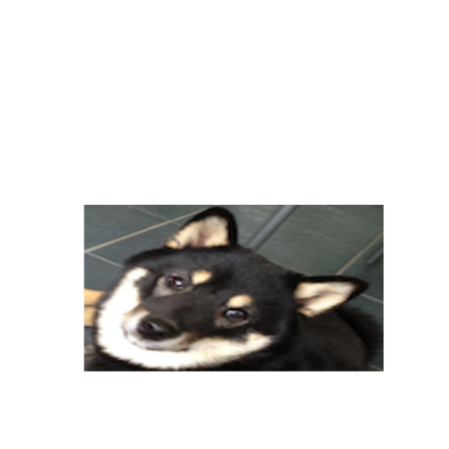

## Starting With Images 


```r
require(png)
```

```
## Loading required package: png
```

```r
require(RCurl)
```

```
## Loading required package: RCurl Loading required package: bitops
```

```r
puppy <- readPNG(getURLContent("http://dtkaplan.github.io/ScientificComputing/Resources/Images/mindo.png"))
COMP121::canvas(x = c(1, 220), y = c(1, 220), asp = 1)
graphics::rasterImage(puppy, 1, 1, 216, 198)
```

 

```r
dim(puppy)
```

```
## [1] 198 216   4
```


## Indexing, Cropping, and Expanding Images 

### Cropping Tasks

#### Mindo's Face

```r
require(png)
require(RCurl)
puppyface <- puppy[1:120, 85:215, ]
COMP121::canvas(x = c(1, 220), y = c(1, 220), asp = 1)
graphics::rasterImage(puppyface, 1, 1, 215, 120)
```

 


#### Mindo's Left Front Paw

```r
require(png)
require(RCurl)
puppypaw <- puppy[80:140, 1:50, ]
COMP121::canvas(x = c(1, 220), y = c(1, 220), asp = 1)
graphics::rasterImage(puppypaw, 1, 1, 50, 140)
```

 

#### Mindo's Dog Tag

```r
require(png)
require(RCurl)
puppytag <- puppy[120:145, 95:140, ]
COMP121::canvas(x = c(1, 220), y = c(1, 220), asp = 1)
graphics::rasterImage(puppytag, 1, 1, 140, 145)
```

 

